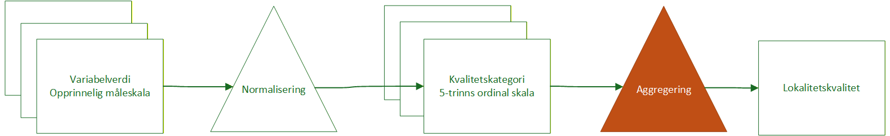
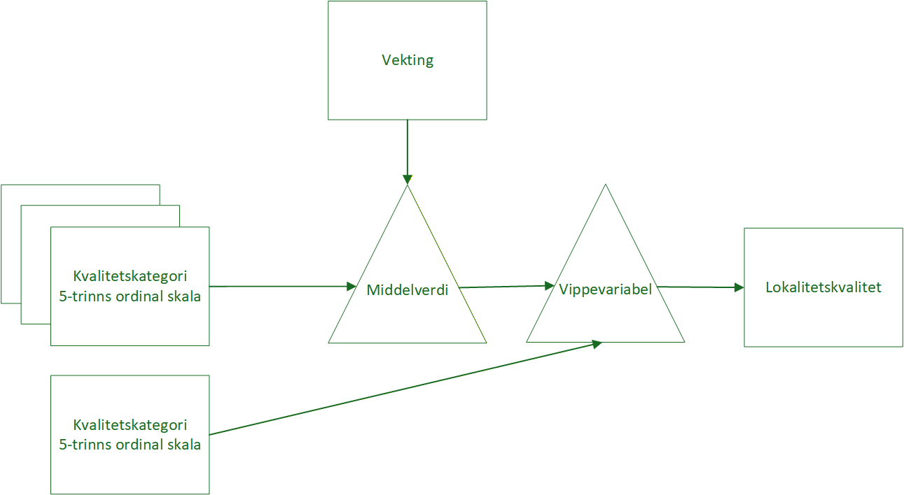
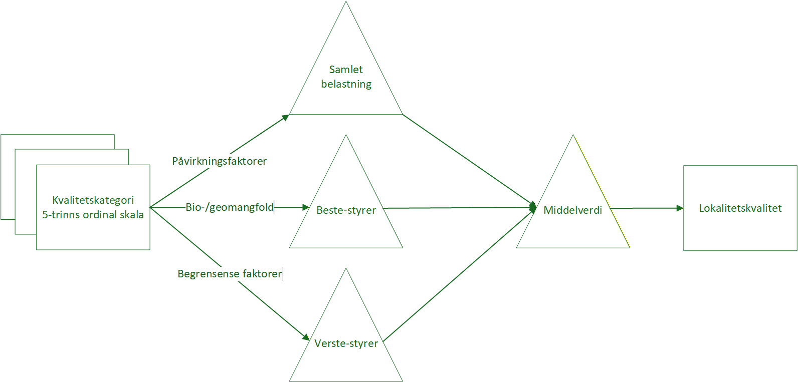
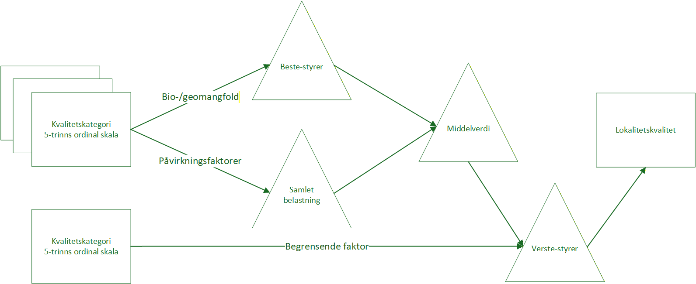

```{r setup}
#| include: false

library(tidyverse)
library(DescTools)
library(gpindex)
library(knitr)
library(kableExtra)
options(knitr.kable.NA = '') 

```

# Om dette notatet

Dette notatet handler om aggregering fra flere til én variabel, eller den fargede trekanten i @fig-agg. Jeg begynner allikevel med en kortfattet beskrivelse av de første delen i denne arbeidsflyten.

Dokumentet er ment å gi nyttig bakgrunnsinformasjon og en innføring i viktige konsepter og problemstillinger. Der jeg har følt det nødvendig å komme med personlige meninger eller annbefalninger har jeg forsøkt å gjør dette tydelig ved å skille ut teksten med _kursiv_. og merket med mine initialer (ALK).

## Variabel og variabelverdi

En variabel er noe som registreres per polygon, typisk en NiN-variabel eller en Mdir-variabel. Variabelverdien er verdien til denne variabelen i på den opprinnelige måleskalaen (e.g. P8).

## Normalisering og kvalitetskategori

For å kunne aggregere (altså _kombinere_) variabler må de være på samme måleskala og like verdier i ulike variabler må ha samme tolkning. Altså de må normaliseres. Systemet i dag er å bruke matriser til oversette (_kode om_) variabelverdier til en 5-trinns ordinal skala. Denne skalaen er normativ på den måten at lave verdier er dårlig og høye verdier er bra. Til tross for navnet så er ikke variablene nå omgjort til fra ordinale til kategoriske. De er fortsatt ordinale, og faktisk så ønsker vi at de skal tolkes som en kontinuerlig numerisk variabel. Det betyr at det bør være tilnærmet lik _avstand_ (i form av kvalitet) mellom kvalitateskategori 1 og 2 som det er mellom 4 og 5. Ofte vil normaliseringen fra variabelverdi til kvalitetskategori innbære en ikke-lineær transformering. 

_ALK: Dette systemet ser ut til å funke veldig greit og det  blant annet svært fleksibelt med tanke på ulike transformeringer, inkludert reversering, dvs. at høye variabelverdier for påvirkningsfaktorer gir lave kvalitetskategorier._ 

```{r fig-agg}
#| fig-cap: "Oversikt over prosessgangen fra flere variabler til én kombinert lokalitetskvlitet. Trekanter er funksjoner. Firkanter er tall, eller data. Hovedfokus i dette dokumentet er den fargede trekanten."
#| echo: false


```

# Aggregering

En aggregering betyr her å kombinere flere variabler, på den normaliserte kvalitetskategoriskalaen, til én felles loaklitetskvalitet. Denne lokalitetskvaliteten blir da en indeks, uten at dette er et begrep vi bruker i MI.

Aggregering han gjøres direkte ( i en operasjon - ett trinn) eller hierarkisk (dvs. i flere etterfølgende trinn). @fig-dagens viser den aggregeringsmetoden som ligger inne som forslag i dag. Her er det en direkte aggregering gjennom en middleverdi, og som middelverdi er det brukt vektet aritmatisk gjennomsnitt. I tillegg er det tenkt brukt en løsning for _vippevariabler_ for utvalgte variabler som bare skal kunne telle positivt på lokalitetskvaliteten. Dvs. at lave verdier for disse vippevariablene ikke skal telle negativt, men høye verdier skal telle positivt. Dettte blir en slags hierarkisk aggregering.

# Kompensasjon

Begrepet med kompensasjon er viktig, altså i hvor stor grad veldig høye verdier i én variabel skal kunne kompensere for lave verdier i andre variable. Om man har høy grad av kompensasjon så løfter man fram det som er bra og ignorer i større grad det som er dårlig. Når kompensasjonen blir veldig høy, så nærmer vi oss en _beste styrer_ type aggregering. Motsatsen til kompenasjon er verste-styrer, men det er egentlig en gradient i hvor stor grad aggregeringsfunksjoner lar seg påvirke av lav verdier. I den [generelle middlefunksjonen](https://people.revoledu.com/kardi/tutorial/BasicMath/Average/Minkowski%20mean.html) kan man endre på parameteren 'R' og få funskjoner lik eller tilnærmet lik kjente funskjoner som aritmetisk og geometrisk gjennomsnitt (@tbl-sammenligning). 



```{r tbl-sammenligning}
#| echo: false
#| tbl-cap: 'Sammenligning av fem ulike versjoner av den generelle middlefunksjonen teste på to eksempel. Eksempel 1 har en lav utligger, og eksempel to har en høy utligger. Graden av kompensering øker fra R=-10, hvor den en veldig lav, til R=10, hvor den er veldig høy.'
r0 <- generalized_mean(r = 0) # geometric
r1 <- generalized_mean(r = 1) # arithmetric
r2 <- generalized_mean(r = 2) # kvadratisk middle
r_min  <- generalized_mean(r = -10) # nesten verste styrer
r_max  <- generalized_mean(r = 10) # nesten beste styrer


dat <- tibble(
    Aggregeringsfunksjon = NA,
    Eksempel_1 = c(1,5,5,5,5),
    Eksempel_2 = c(1,1,1,1,5))

minus <- dat |>
  summarise(across(starts_with("Eksempel"), ~r_min(.x, na.rm = TRUE))) |>
  mutate(Aggregeringsfunksjon = "R = -10 (~verste-styrer)") |>
  select(Aggregeringsfunksjon, everything())

null <- dat |>
  summarise(across(starts_with("Eksempel"), ~r0(.x, na.rm = TRUE))) |>
  mutate(Aggregeringsfunksjon = "R = 0 (geometrisk middel)") |>
  select(Aggregeringsfunksjon, everything())

en <- dat |>
  summarise(across(starts_with("Eksempel"), ~r1(.x, na.rm = TRUE))) |>
  mutate(Aggregeringsfunksjon = "R = 1 (aritmetisk middel)") |>
  select(Aggregeringsfunksjon, everything())

to <- dat |>
  summarise(across(starts_with("Eksempel"), ~r2(.x, na.rm = TRUE))) |>
  mutate(Aggregeringsfunksjon = "R = 2 (kvadratisk middel)") |>
  select(Aggregeringsfunksjon, everything())

ti <- dat |>
  summarise(across(starts_with("Eksempel"), ~r_max(.x, na.rm = TRUE))) |>
  mutate(Aggregeringsfunksjon = "R = 10 (~beste styrer)") |>
  select(Aggregeringsfunksjon, everything())

dat <- dat |>
    rbind(minus, null, en, to, ti)

dat |>
  kable(booktabs = TRUE, digits = 2, na = "") |>
  kableExtra::row_spec(5, hline_after = TRUE)
```


I økologisk tilstand brukes middles kompensasjon for gi et overordnet blikk på naturen som er mindre følsomt for enkeltindikatorer. 
I Vannforskriften brukes ingen kompensasjon (de bruker verste-styrer) fordi de ønsker å synliggjøre de områdene hvor det kreves tiltak.
Om man ønsker å fremheve området med høy verdi på minst én av variablene, så kan man bruke en høyere R verdi, eller bruke en beste-styrer regel mer direkte.
I @sec-hier skal vi se at ulike R verdier, eller ulike aggregeringsfunksjoner, kan brukes for ulike grupper av indikatorer per naturtype.


## Vekting {#sec-vekting}

Vektingen i dagens løsning foregår på den måten at ekpertgruppene fastsetter relative vekter for alle variablene, og variabler med høy vekt har større påvirkning på den aggregerte lokalitetskvaliteten. Øvelsen med fastsetting av vekter er en relativt arbeidskrevende oppgave, og krever at det gøres flere vanskelig og delvis normative valg. Det er også en vanlig hendelse at tolkningne av _viktighet_, dvs. det som skal bestemme om en variabel skal vektes høyt eller lavt, spriker mellom forskere eller mellom variabler. For eksempel brukes vekting noen ganger til å beskrive hvor _vanlig_ noe er, og kaskje ikke direkte for å beskrive hvor viktig noe er _gitt_ at det er vanlig eller forekommer. 


_ALK: Vekting kan være en kilde til usikkerhet skepsis hos brukere. En grunn er at begrunnelsen for vektingen ikke alltid, heller kanskje heller sjeldent, kan begrunnes fra emipiri eller økologisk teori. Men enda viktigere er det at vektingen brukes til å forhåndsvurdere lokaliteter. Dette kan skje når _viktigheten_ til en variabel blandes sammen med begreper om hvor vanlig et fenomen er. For eksempel: Hvis man tenker at fremmedarter på våtmark ikke er et stort problem, og derfor gir denne variabelen lav vekt, har man da egentlig sagt at fremmedarter _pleier ikke være et problem_ på våtmark? Jeg vil påstå at et gitt fremmedartsinnslag på våtmark er like problematsik og viktig for kvaliteten der, som tilsvarende fremmedartsinnslag er på semi-naturlig mark eller andre steder. At det er mindre vanlig på våtmark er ikke det vektingen skal svare på. Det er vanskelig å unngå at vektingen brukes på denne måten. Hierarkisk aggregering gir andre måter å vekte på som ikke går på variabelnivå, og som jeg tror gir bedre og mer etterprøvbare beregninger av lokalitetskvalitet._


```{r fig-dagens}
#| echo: false
#| fig-cap: 'Aggregeringsløype i dagens forslag til beregning av lokalitetskvalitet.'


```


### Hierarkisk aggregering {#hier}

Jeg fører hierarkisk aggregering under vekting siden tanken med dette er å kunne kombinere utvalg av variablene til grupper slik at man kan kontrolere for den relative vektingen mellom gruppene. Jeg kaller disse gruppene for _dimensjoner_. I MI, slik instruksen brukes i dag, er det en hierarksik aggregering med to dimensjoner: tilstand og bimangfold. Valg av dimensjoner er viktig, og det er flere innganger til hvordan og hvorfor disse bør defineres.

@fig-hierarkisk viser en variant av hierarkisk aggregering med tre dimensjoner, der dimensjonene grovt sett tilsvarer den gamle _tilstandsdimensjonen/-aksen_ (der de fleste variablene var påvirkningsvariabler og ikke tilstandsvariabler) og biomangfoldsdimansjonen/-aksen (utvidet til å inkludere geomangfold, for å være politisk korrekt). I tillegg har jeg tatt med en gruppe for _begrensende faktorer_. De tre gruppene, eller dimensjonene, bruker en ulik aggregeringsfunksjon. (Merk at ingen av de bruker aritmetisk gjennomsnitt.) Under den neste overskriften vil jeg beskrive noen fordeleg og ulemper med ulike aggregeringsfunksjoner (@sec-func). 

Tanken videre er at de tre dimensjonene skal ha lik innflytelse på lokalitetskvaliteten. Om man tenker at de begrensene faktorene, for eksempel, er såpass avgjørende for økosystemets funksjon (jeg tenker på hydrologi i myr som eksempel), så kan man flytte dette aggregeringstrinnet bakover i prosessen, slik som vist i @fig-hierarkisk2. Dette er en form for vekting, men den er mellom grupper, selv om gruppene gjerne har kun én eller noen få variabler hver. En slik tilnærming til vekting er mer fleksibel og kanskje lettere å beskrive, i hvertfall hvis samme aggregeringsrekkefølge brukes konsekvent for alle naturtypene. 

_ALK: Hierarkisk aggregering med gjennomtenkte dimensjoner og tilhørende aggregeringsfunksjoner, gir et mer transparent og etterprøvbart vektings- og aggregeringssystem kontra dagens forslag. Det gjør det også mulig å unngå at lokalitetskvalitetverdiene regresserer mot en slags middelverdi der det blir vansklig å få ut lokaliteter med veldig høye eller veldig lave lokalitetskvalitatsverdier._

```{r fig-hierarkisk}
#| echo: false
#| fig-cap: 'Eksempel på hierarkisk aggregeringsløype med tre dimensjoner, der hver dimensjon har en aggregeringsfunksjon tilpasset sitt behov eller sin logikk, og der dimensjonene ti slutt vektes likt i en ny aggregering fra gruppene/dimensjonene til lokalitetskvaliteen.'


```


```{r fig-hierarkisk2}
#| echo: false
#| fig-cap: 'Eksempel, tilsvarende forrige figur, men hvor variablene som er kategorisert som begrensende faktorer gis muligheten til å overstyre kvalitetsverdien fra de to andre dimensjonene, gitt at den har lavere verdi enn de.'


```

### Aggregeringsfunksjoner {#sec-func}

Det finnes utallige måter å aggregere variabler på (se @tbl-sammenligning og husk at 'R' kan ta hviklen som helst verdi). Jeg begrenser meg allikevel til et utvalg som jeg tenker er de mest relevante.

#### Aritmetisk gjennomsnitt

Dette er en type middelverdi, og den mest kjente sådann. Det er hva man tenker på som _å ta snittet av noe_. En lignende metode, bare for aggregering av fordelinger og ikke enkeltverdier, er resampling. Denne typen middleverdi brukes i beregning av indekser i Naturindeks og Økologisk tilstand. Begge disse indeksene harsom mål å beskrive _gjennomsnittlig tilstand_ over realtivt store arealer. Dette skiller seg fra vårt mål om å beskrive _kvalitet_ på relativt små arealer. Aritmetisk gjennomsnitt har middels kompensering som gjør det mulig å _kompensere_ for veldig lave verdier i en variabel, med veldig høye verdier for en annen variabel (og motsatt). Hvis en slik kompensering ikke er ønskelig, bør aritmetisk gjennomsnitt ikke brukes.   

#### Beste-styrer og verste-styrer

Disse er relativt enkle: i beste-styrer er det variabelen med beste (høyeste) verdi (kvalitetskategori) som styrer og i verste-styrer er det motsatt. Variabler som ikke er hhv- høyeste eller lavest bli ikke tatt med i beregningene videre. Verste-styrer brukes blant annet i vannforskriften. Metoden bygger på et _føre-var_ prinsipp og gir en konservativ vurdering av tilstand i vannforekomster. 

Beste-styrer har jeg ikke noen eksmpler på at er brukt. Metoden er spesielt relevant når man har flere variabler der verdien oftest er lav, for eksempel pga lav deteksjonsrate som på sopp pg rødlistearter, og der variablene ofte samvarierer og kan være indikatorer på hverandre. For eksmepel, har du mye død ved så kan dette en indikator på biodiversitet, og da bør det kanskje ikke gjøre noe om du ikke fant noen rødlistearter den dagen. Og motsatt, finner du mange rødlistearter, så gjør det kanskje ikke noe at det er lite dødved, siden det tydeligvis er noe annet ved lokaliteten som gir høy habitatsverdi.

Beste-styrer brukes i @fig-hierarkisk og @fig-hierarkisk2 for biomangfoldsvariablene, og det er kanskje helst der denne aggregeringsfunksjonen har sin nytte. Bruken av beste-styrer kan delvis erstatte det som har vært hensikten med vippevaribler, nemlig at lave verdier for noen variabler ikke skal trekke ned lokalitetskvaliteten.

Disse to aggregeringsfunksjonene er regelstyrte (man forkaster alle verdier som ikke er den laveste eller høyeste), men man også velge å definere dette mer nyansert slik alle variablene teller med i beregingen, men at det er de veldig høye eller veldig lave som teller mest (@tbl-sammenligning).


#### Geometrisk gjennomsnitt

Et geometrisk gjennomsnitt gir høyere vekt på lave verdier, og er derfor mer konservativ enn aritmetisk gjennomsnitt. Om man ønsker å frmeheve de dårlige kvalitetene ved en forekomst, så er dette en bedre løsning. Den brukes blant annet i i [Human Developemt Index](https://hdr.undp.org/data-center/human-development-index#/indicies/HDI), som byttet fra aritmetisk til geometrisk gjennomsnitt nettopp av denne grunnen at de ønsket mindre kompensering.


#### Samlet belastning

Dette er ikke egentlig en aggregeringsfunskjon, slik som de øvrige, men heller et begrep fra bærekraftsforskning og lignende fagfelt. Tenken er at menneskelig påvirkning på økosystemene _bygger på hverandre_, at de er additive, og at påvirkningen akkumuleres etter hvert som flere påvirkninger bli gjeldende. Det er ulike måter å beregne samplet belastning på. Den mest intuitive og enkle er å summere sammen variabler. I noen tilfeller kan dette fungere, hvis virkningen av variablene faktisk er additiv. En annen tilnærming er å definere en ny sammensatt variabel der man med noen gitte regler, kombinere flere variabler til en. Ett eksempel på en sammensatt variabel som vi har i dag er _naturskogsnærhet_, selv om denne heller beskriver et positiv egenskap og ikke en belastning eller negativ påvirkning. 

Et eksempel til kommer fra økologisk tilstand, der indikatorene slitasje og kjørespor ble kombinert til [én variabel](https://ninanor.github.io/ecosystemCondition/slitasje.html). Den fysiske terrengskaden som registreres gjennom disse to variablene bli ofte fordelt mellom de to variablene av kartlegger i felt. Men intuitivt så skjønner vi at det er den kombinerte verdien av disse to variablene som er relevant å beskrive. Og så er det kanskje ikke så lett som å summere de to variablene, siden måleskalene ikke er kontinuerlige. 

Et annet eksempel er tresjiktdekke av bøk og gran, som begge er en negativ påvirkning i visse skogtyper. Trekrone kan overlappe betraktelig, så et summert kronedekke vil lett kunne overstike 100%. En løsning på akuratt dette problemet er å registrere dette som én variabel i felt. En annen løsning er å bruke en sub-additiv sum der man selv kan bestemme i hvor stor additivitet/komplementaritet man ønsker det skal være. Da kan men tune formelen slik at 2 + 2 blir et sted mellom 2 (ingen komplementaritet) og 4 (full komplementaritet).

# Scenarioer

Jeg har laget sju eksempler med hypotetiske lokaliteter med ulike variabelverdier for å vise hvordan ulike aggregerings/_løyper_ slår ut på lokalitetskvalitaten (@tbl-examples).
Variebelverdiene er i form av kvalieteskategori.
Eksempel S1 i @tbl-examples viser en lokalitet med lave verdier for påvirkning (dvs. høy grad av negativ påvirkning), middles bimangfold, og en begresnende faktor som har så høy verdi at den ikke blir begrensene. Med et aritmetisk gjennomsnitt, uten hensyn til dimensjonene, får vi verdi 3. Samme verdi får vi om vi reverserer variabelverdiene i S2, siden vi ikke tar hensyn til dimensjonene. Den hierarkiske aggregeringsløypen med aritmetisk gjennomsnitt gir 3.3 - litt høyere dimensjonen _begrensende faktor_ veier like mye som hver av de to andre dimensjonene.

Aggregeringsløypen som tilsvarer raden _Hier.ulike_ i @tbl-examples er ganske tilsvarende samme som i @fig-hierarkisk2. Påvirkningsvariablene aggregeres med et geometrisk gjennomsnitt som gir lave verdier litt mer vekting. Biomangfoldsvariablene aggregeres med verste'styrer, slik at for S4 for eksempel, så er det kun den høystskårende variabelen på biomangfold som teller med i lokalitetskvaliteten. Variabler som er betegnet som begrensende faktorer overstyrer det aritmetiske gjennomsnittet av påvirkningsvariablene og biomangfoldvariablene dersom den har lavere verdi. Dette skjer kun i S2. 


# Konklusjon

- Ulike aggregeringsløyper kan gi helt forskjelige svar på lokalitetskvalitet og det må tenkes nøye gjennom hva man ønsker at denne lokalitetsverdien skal vise. Skal det være et poeng å vise fra med gode ved en lokalitet, eller å vise fram det dårlige. Eller en kombinasjon, slik jeg har vist i @fig-hierarkisk2 og i siste rad i @tbl-examples. Dette hanger nøye sammen med konseptet om kompensasjon.
- Aritmetisk gjennomsnitt gjør det vanskelig å oppnå svært gode eller svært lave lokalitetskvalitatsverdier. Når antallet variabler øker, går denne muligheten faktisk mot null.
- Vekting av enkeltindikatorer er en vanskelig oppgave med store sjanser for ulik tokning av oppgaven. Resultatet kan i alle tilfeller utfordres og kritiseres for manglende objektivitet. Hierarksik aggregering represneterer også verdivalg, men det gjøres på et høyere teoretisk plan (vekting mellom dimensjonene) og er derfor lettere å forsvare og argumentere for. 




```{r tbl-examples}
#| warning: false
#| echo: false
#| tbl-cap: 'Eksempler på hvordan ulike aggregeringsløyper påvirker samlet lokalitetskvalitet. S1 til S5 er ulike lokaliteter med ulike fordeling av variabelverdier. De fem variablene er puttet en en av tre dimensjoner: påvirkning, biomangfold eller begrensende faktor. I metoden aritmetisk gjennomsnitt (Ar.gj.) er det tatt et enkelt gjennomsnitt på tvers av alle fem variablene, uten hensyn på hviklen dimensjon de er tilskrekvet. I hierarkisk aritmetisk gjennomsnitt er det først tatt et snitt per dimensjon, så et snitt på tvers av dimensjoner. I siste eksempelet, hierarkisk aggregering med ulike funksjoner, er det brukt en geometrisk middleverdi når man har aggregert påvirkningsdimensjonen. Lave verdier teller da litt mer enn når man bruker aritmetisk gjennomsnitt. Biomangfolddimensjonen er aggregert med beste-styrer prinsippet. Til slutt brukes variablene merket som  begrensende faktorer til å overstyre snittet mellom påvirkningsfaktorene og biomangfoldsvariablene, derson verdien er lavere.'
# create dummy data
dat2 <- tibble(
    Dimensjon = c(rep("Påvirkning",2), rep("Biomangfold", 2), "Begrensende_faktor"),
    S1 = seq(1:5),
    S2 = seq(from =5, to = 1),
    S3 = c(5,4,3,2,5),
    S4 = c(1,5,1,5,NA),
    S5 = c(3,3,3,3,NA),
    S6 = c(1,5,5,5,5),
    S7 = c(1,1,1,1,5))


# calculate simple column means
mean_overall <- dat2 |>
  summarise(across(starts_with("S"), ~mean(.x, na.rm = TRUE))) |>
  mutate(Dimensjon = "Ar.gj.") |>
  select(Dimensjon, everything())

# Calculate hierarcichal arithmetic means
mean_per_dim <- dat2 |>
  group_by(Dimensjon) |>
  summarise(across(starts_with("S"), ~mean(.x, na.rm = TRUE)), .groups = "drop") |>
  summarise(across(starts_with("S"), ~mean(.x, na.rm = TRUE))) |>
  mutate(Dimensjon = "Hier.ar.gj.") |>
  select(Dimensjon, everything())

# Calculate hierarchical aggregate using functions tailored to each dimensjon 
mean_per_dim_custom <- dat2 |>
  group_by(Dimensjon) |>
  summarise(across(starts_with("S"), ~case_when(
    Dimensjon == "Påvirkning" ~ r0(.x, na.rm = TRUE),
    Dimensjon == "Biomangfold" ~ max(.x, na.rm = TRUE),
    Dimensjon == "Begrensende_faktor" ~ min(.x, na.rm = TRUE),
    TRUE ~ NA_real_))) |>
  summarise(across(starts_with("S"), ~mean(.x, na.rm=T))) |>
  ungroup() |>
  mutate(across(starts_with("S"), ~ replace(.x, is.infinite(.x), NA))) |>
  add_column(worst_rule = c("yes", "no", "no")) |>
  group_by(worst_rule) |>
  summarise(across(starts_with("S"), ~mean(.x, na.rm=T))) |>
  mutate(across(starts_with("S"), ~ replace(.x, is.nan(.x), NA))) |>
  ungroup() |>
  summarise(across(starts_with("S"), ~min(.x, na.rm=T))) |>
  mutate(Dimensjon = "Hier.ulike") |>
  select(Dimensjon, everything())

# Add rows to original dataframe
dat_final <- bind_rows(dat2, mean_overall, mean_per_dim, mean_per_dim_custom)

dat_final |>
  kable(booktabs = TRUE, digits = 1, na = "") |>
  kableExtra::row_spec(5, hline_after = TRUE) |>
  kableExtra::pack_rows("Metode", 6, 8)
```